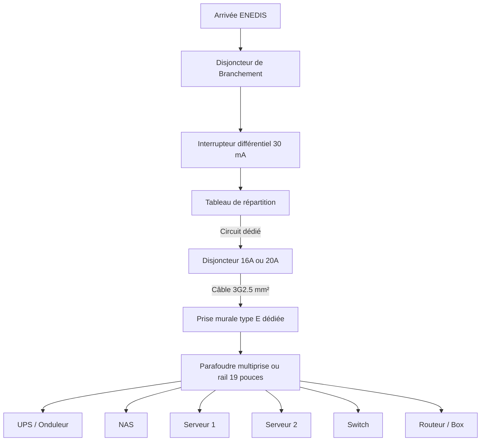

# Sécurité électrique dans un homelab : normes, limites, protections et bonnes pratiques

Lorsqu’on installe un homelab à domicile (serveurs, NAS, switchs, routeurs, firewall...), il est essentiel d’intégrer une réflexion sur la sécurité électrique. En France, les installations domestiques sont régies par la norme **NF C 15-100**, qui définit les règles applicables pour la distribution de l’électricité, la protection des circuits et la sécurité des personnes. Même si un homelab ne nécessite pas une installation spécifique, comprendre ces principes permet d’éviter les risques d’incendie, de surcharge ou de défaillance matérielle.

Là nous avons un problème ! En fonction de si vous êtes en location ou si vous êtes propriétaire de votre logement, votre capacité à tirer des câbles dans les murs varie ! Il faut parfois s'adapter à un existant et se limiter dans le dimensionnement de l'infrastructure. Nous rappellerons plus bas les limites communes admises des prises domestiques.

> [!tip] Conseil
> Gardez à l'idée que votre installation peut ne pas respecter les normes en vigueur (on trouve ça parfois dans les vieux appartements) et un audit électrique peut parfois vous sauver la vie. Si vous lisez ces lignes, vous n'êtes pas à 200 euros près. 

## Norme NF C 15-100 : ce qu’elle impose pour les circuits domestiques

![[Pasted image 20251122210555.png]]

La norme NF C 15-100 encadre la conception et la protection des circuits électriques. Pour les prises de courant classiques (circuit 230V), elle définit deux sections de câbles possibles :

> [!info]
> - **Circuit 16 A (1,5 mm²)** → puissance maximale recommandée : **3 680 W**
> - **Circuit 20 A (2,5 mm²)** → puissance maximale recommandée : **4 600 W**

Un homelab dépasse souvent les 500w de consommation continue, il est crucial de savoir que **toutes les prises d’un même circuit partagent la même limite** (NDLR : toutes les prises reliées à un seul et même disjoncteur font parti d'un même circuit). Brancher un radiateur, un aspirateur ou un simple sèche cheveux sur le même circuit (la prise d'à côté par exemple ?) qu’un serveur informatique peut donc provoquer une surcharge (qui devrait faire disjoncter le circuit au tableau électrique) ou provoquer un échauffement et un incendie.

On gardera à l'idée qu'un serveur consomme entre 200 et 3000 W en fonction des éléments qui le composent. Un bon indicateur est la puissance de crête de l'alimentation souvent indiquée.

Le cheminement idéal ressemble à ça : 

## Que peut-on mettre sur une prise ?

Une prise murale 16A supporte théoriquement jusqu’à 3,6 kW en continu, mais ce n’est pas une bonne pratique d’aller au maximum. Pour du matériel électronique sensible :
- Rester entre 20% et 50% de la capacité est recommandé pour éviter l’échauffement.
- Vérifier la qualité des câbles et éviter les rallonges bas de gamme : si vous êtes dans un vieil immeuble et que la prise de courant a une mauvaise tête, ne prenez pas le risque, faites venir un électricien (ou demandez à votre proprio de le faire !)    
- Éviter les transformateurs/chargeurs multiples sur la même prise (pertes et chaleur).

Pour un homelab typique (100 à 600 W), une seule prise 16A est largement suffisante.

## Multiprises : utiles mais avec précaution

Les multiprises sont autorisées, mais la norme NF C 15-100 interdit les "multiprises en cascade" (brancher une multiprise sur une autre).

> [!danger] Attention !
> **En cas d’incendie : l’assureur peut réduire ou refuser l’indemnisation** !
> 
> C’est là que le vrai risque commence. En cas d'incendie, les assureurs se basent sur les conclusions des pompiers, les experts après sinistre et les normes de sécurité (dont NF C 15-100) pour établir l'origine de l'incendie et les responsabilités.
> 
> Si l'expert constate que l’incendie a démarré à cause :
> - d’une multiprise surchargée,
> - d’un branchement non conforme,
> - d’une multiprise en cascade,
> - ou d’un élément chauffant branché sur une multi,
>  
> alors l’assureur peut invoquer :
> - une “faute d’imprudence” : réduction de l’indemnisation (fréquent)
> - une “négligence grave” : exclusion partielle ou totale (plus rare mais possible).
> 
> Ce que tu risques concrètement : 
> - ✔ L’assurance paye presque toujours les dommages aux tiers
(parce que c’est obligatoire légalement via la garantie RC habitation).
> - ❌ Mais elle peut réduire ou refuser l’indemnisation de tes propres biens (TV, Ordinateurs, bijoux, vêtements...)
(considérés comme “contenu” ou “mobilier” dans un contrat habitation).
> 
> Tu pourrais donc :
> - **rembourser ton propriétaire** si l'appartement est dégradé (via RC),    
> - mais **ne rien recevoir** pour tes meubles, ton informatique, ton homelab, etc.

Attention donc quand vous branchez votre homelab a ne pas brancher des multiprises en cascade, utiliser du matériel sur lequel figure le logo **CE** (gage du respect des normes européennes) (oui je vous vois les ptis malins sur aliexpress...) et réfléchissez en amont de votre achat les impacts sur le réseau électrique de votre maison.

**Un incendie n'arrive pas qu'aux autres.**

## UPS / Onduleur : indispensable dans un rack ?

Pour un homelab, un UPS (onduleur) apporte une sécurité très importante :
1. Protection contre les coupures courtes (micro-coupures imperceptibles mais destructrices pour les SSD et systèmes de fichiers).
2. Arrêt propre des machines en cas de coupure prolongée.
3. Stabilisation de la tension (fonction AVR).
4. Filtrage des surtensions complémentaires au parafoudre.
5. Continuité réseau pour les routeurs, box Internet, switchs PoE.

Les serveurs Proxmox/TrueNAS/Kubernetes peuvent communiquer avec l’onduleur via NUT ou APC UPS Daemon, permettant un arrêt automatique si la coupure électrique dure plus de N minutes.
## Conclusion

Un homelab fiable passe aussi par une installation électrique sécurisée.  
En respectant la norme NF C 15-100, en contrôlant les charges sur une prise, en utilisant des multiprises certifiées, en intégrant un parafoudre et un onduleur adapté à la charge, on réduit drastiquement les risques d’incendie, de perte matérielle ou de corruption de données. Un petit investissement dans la qualité électrique garantit une infrastructure stable, durable et résiliante, indispensable pour un homelab utilisé au quotidien.