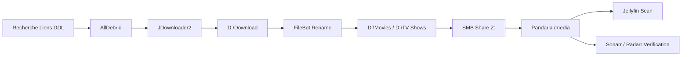

# 🎬 Workflow de gestion média personnel (Films & Séries)

> Oui, je télécharge exclusivement des œuvres **libres de droit**.  
> Certaines ont juste eu la gentillesse de sortir en Blu-ray 4K HDR 10 avant d’entrer dans le domaine public.

---

# 🎯 Objectif

Mettre en place un workflow **simple, rapide et fiable** pour alimenter ma médiathèque **Jellyfin** sans dépendre entièrement de ses mécanismes de détection automatique.

Ce pipeline me permet :

- de garder le contrôle sur les fichiers téléchargés
- d’assurer un nommage propre et conforme à un référenciel
- d’éviter les erreurs de scraping des gestionnaires de bilbiothèques comme Plex ou Jellyfin
- de transférer et d'importer rapidement vers le serveur principal
- de compléter ensuite automatiquement avec Sonarr / Radarr

---

# 🖥️ Architecture utilisée

## Poste personnel Windows

Utilisé pour :

- navigation web
- récupération des liens
- téléchargement via JDownloader2
- renommage via FileBot

## Serveur principal : Pandaria

Rôles :

- NAS principal
- Serveur Jellyfin
- Sonarr / Radarr
- Stockage média centralisé

---

# 📁 Arborescence

## PC Windows

```text
D:\Download
D:\Movies
D:\TV Shows
```

## Serveur Pandaria

```text
/media/movies
/media/tv
```

Montage réseau permanent :

```text
Z:
```

---

# 🔧 Outils utilisés

| Outil | Rôle |
|------|------|
| AllDebrid | Débridage des hébergeurs |
| JDownloader2 | Gestionnaire de téléchargement |
| FileBot | Renommage intelligent |
| SMB | Transfert LAN |
| Jellyfin | Streaming |
| Sonarr | Gestion séries |
| Radarr | Gestion films |

---

# ⚙️ Workflow complet

## 1. Recherche des fichiers

Je récupère les contenus sur des plateformes d’indexation de liens DDL.

## 2. Débridage + téléchargement

Les liens sont envoyés vers **JDownloader2 + Plugin AllDebrid**

Téléchargement local vers :

```text
D:\Download
```

## 3. Renommage massif avec FileBot

- détection automatique
- correspondance TMDB / TVDB
- renommage propre
- classement automatique

Destination :

```text
D:\Movies
D:\TV Shows
```

## 4. Transfert vers Pandaria

Partage SMB permanent monté sur :

```text
Z:
```

Copie :

```text
D:\Movies  -> Z:\movies
D:\TV Shows -> Z:\tv
```

## 5. Scan Jellyfin

Jellyfin lit directement :

```text
/media/movies
/media/tv
```

## 6. Vérification via Sonarr / Radarr

- épisodes manquants
- saisons incomplètes
- collections incomplètes
- upgrades qualité

---

# ⏱️ Temps moyen

| Type | Temps |
|------|------|
| Film unique | ~5 min |
| Saison complète | ~15 min |

---

# 🔄 Diagramme Workflow



---

# 🖥️ Diagramme Infrastructure

```mermaid
flowchart TB

subgraph Windows PC
A[JDownloader2]
B[FileBot]
C[D:\Storage]
end

subgraph Pandaria Server
D[/media/movies]
E[/media/tv]
F[Jellyfin]
G[Sonarr]
H[Radarr]
end

A --> C
C --> B
B --> D
B --> E

D --> F
E --> F

D --> G
E --> G

D --> H
E --> H
```

---

# 🧠 Conclusion

Je préfère une approche :

> semi-automatique intelligente

Je garde :

- le contrôle humain au début
- l’automatisation intelligente à la fin

Le meilleur des deux mondes.
