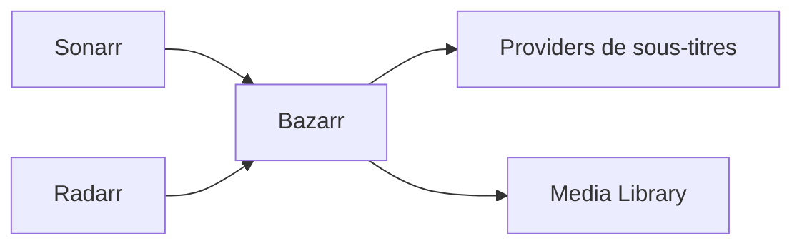

# Bazarr


    

## 🧠 Description
**Bazarr** Téléchargement et gestion automatique des sous-titres, intégré à Sonarr/Radarr.

## ⚙️ Fonctions principales
- 💬 Recherche sous-titres
- 🔄 Synchronisation bibliothèques
- 🌍 Multi-fournisseurs
- 🧩 API
- ⚙️ Profilage langues

## 🔗 Intégrations
- [[Sonarr]]
- [[Radarr]]

## 🧬 Flux de données


# Intégration

## Pré-requis
- Docker + Docker Compose
- Accès réseau aux services intégrés (ex: [[Prowlarr]], [[Transmission]], [[Jellyfin]]…)
- (Optionnel) Stockage persistant (NAS, ZFS, etc.)

## Docker-compose
```yaml
services:
  bazarr:
    image: lscr.io/linuxserver/bazarr:latest
    container_name: bazarr
    restart: unless-stopped
    environment:
      - PUID=1000
      - PGID=1000
      - TZ=Europe/Paris
    ports:
      - "6767:6767"
    volumes:
      - ./bazarr/config:/config
      - ./bazarr/media:/data
```

# Liens externes
- GitHub : https://github.com/morpheus65535/bazarr
- Site : https://www.bazarr.media

# Notes
- À compléter (bonnes pratiques, profils TRaSH, hardlinks, permissions, etc.)

# Avis de l'auteur
- À compléter
