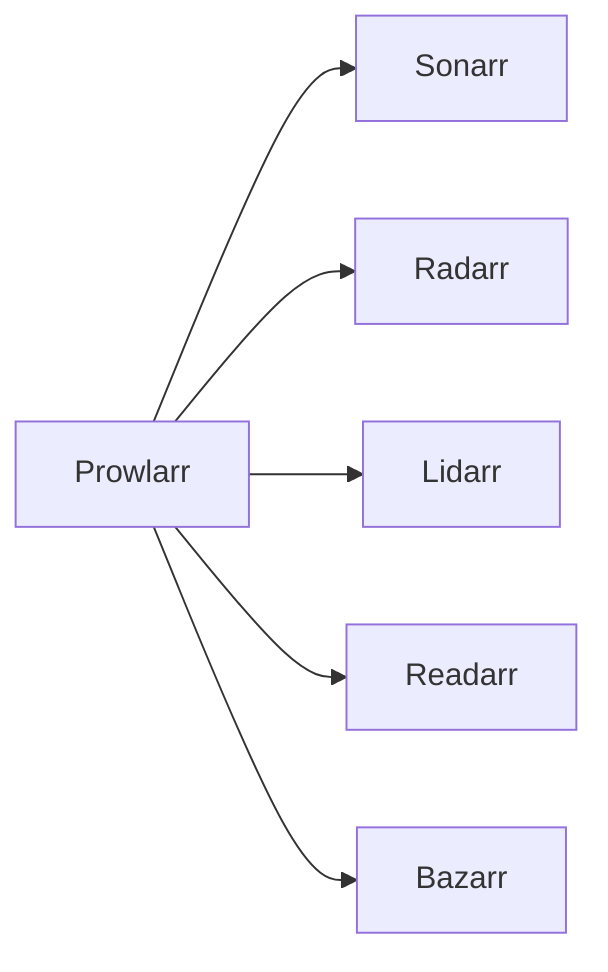

# Prowlarr


    

## 🧠 Description
**Prowlarr** Gestion centralisée des indexers (torrent/usenet) pour l’ensemble des *Arr.

## ⚙️ Fonctions principales
- 🔎 Ajout & gestion d’indexers
- 🧠 Sync vers Sonarr/Radarr/etc.
- 🔐 Support API keys
- 📊 Santé des indexers
- 🧩 API & UI centralisées

## 🔗 Intégrations
- [[Sonarr]]
- [[Radarr]]
- [[Lidarr]]
- [[Readarr]]
- [[Bazarr]]

## 🧬 Flux de données


# Intégration

## Pré-requis
- Docker + Docker Compose
- Accès réseau aux services intégrés (ex: [[Prowlarr]], [[Transmission]], [[Jellyfin]]…)
- (Optionnel) Stockage persistant (NAS, ZFS, etc.)

## Docker-compose
```yaml
services:
  prowlarr:
    image: lscr.io/linuxserver/prowlarr:latest
    container_name: prowlarr
    restart: unless-stopped
    environment:
      - PUID=1000
      - PGID=1000
      - TZ=Europe/Paris
    ports:
      - "9696:9696"
    volumes:
      - ./prowlarr/config:/config
      - ./prowlarr/media:/data
```

# Liens externes
- GitHub : https://github.com/Prowlarr/Prowlarr
- Site : https://prowlarr.com

# Notes
- À compléter (bonnes pratiques, profils TRaSH, hardlinks, permissions, etc.)

# Avis de l'auteur
- À compléter
