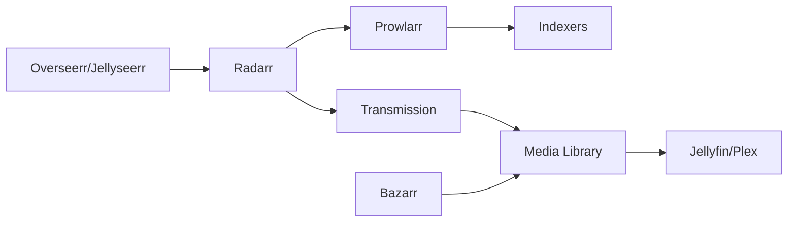

# Radarr


    

## 🧠 Description
**Radarr** Gestionnaire de films automatisé (monitoring, téléchargement, renommage, organisation).

## ⚙️ Fonctions principales
- 🎬 Suivi de films
- 📂 Renommage/organisation
- 🔄 Upgrade qualité
- 🔗 Intégration indexers + downloaders
- 🧩 API complète

## 🔗 Intégrations
- [[Prowlarr]]
- [[Jellyfin]]
- [[Transmission]]

## 🧬 Flux de données


# Intégration

## Pré-requis
- Docker + Docker Compose
- Accès réseau aux services intégrés (ex: [[Prowlarr]], [[Transmission]], [[Jellyfin]]…)
- (Optionnel) Stockage persistant (NAS, ZFS, etc.)

## Docker-compose
```yaml
services:
  radarr:
    image: lscr.io/linuxserver/radarr:latest
    container_name: radarr
    restart: unless-stopped
    environment:
      - PUID=1000
      - PGID=1000
      - TZ=Europe/Paris
    ports:
      - "7878:7878"
    volumes:
      - ./radarr/config:/config
      - ./radarr/media:/data
```

# Liens externes
- GitHub : https://github.com/Radarr/Radarr
- Site : https://radarr.video

# Notes
- À compléter (bonnes pratiques, profils TRaSH, hardlinks, permissions, etc.)

# Avis de l'auteur
- À compléter
