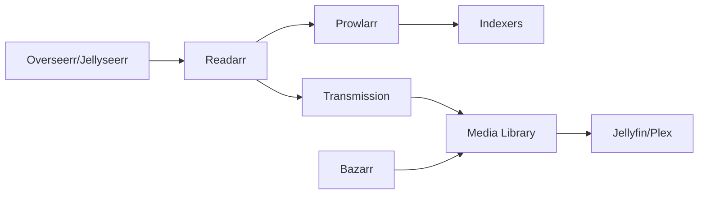

# Readarr


    

## 🧠 Description
**Readarr** Gestionnaire de livres/ebooks/audiobooks automatisé (monitoring, téléchargement, organisation).

## ⚙️ Fonctions principales
- 📚 Suivi auteurs/séries
- 📂 Organisation ebooks/audiobooks
- 🔄 Upgrade qualité
- 🔗 Indexers + downloaders
- 🧩 API complète

## 🔗 Intégrations
- [[Prowlarr]]
- [[Transmission]]

## 🧬 Flux de données


# Intégration

## Pré-requis
- Docker + Docker Compose
- Accès réseau aux services intégrés (ex: [[Prowlarr]], [[Transmission]], [[Jellyfin]]…)
- (Optionnel) Stockage persistant (NAS, ZFS, etc.)

## Docker-compose
```yaml
services:
  readarr:
    image: lscr.io/linuxserver/readarr:latest
    container_name: readarr
    restart: unless-stopped
    environment:
      - PUID=1000
      - PGID=1000
      - TZ=Europe/Paris
    ports:
      - "8787:8787"
    volumes:
      - ./readarr/config:/config
      - ./readarr/media:/data
```

# Liens externes
- GitHub : https://github.com/Readarr/Readarr
- Site : https://readarr.com

# Notes
- À compléter (bonnes pratiques, profils TRaSH, hardlinks, permissions, etc.)

# Avis de l'auteur
- À compléter
