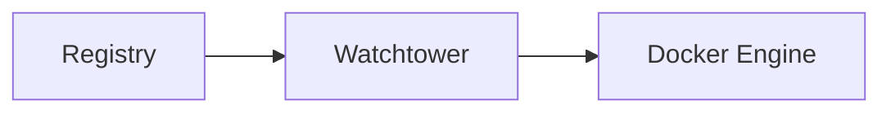

# Watchtower


    

> [!warning] Projet original archivé
> Le dépôt historique `containrrr/watchtower` a été archivé le 17/12/2025 (mainteneurs partis). Cette fiche pointe désormais vers le **fork actif** `nicholas-fedor/watchtower`, compatible à l'identique (mêmes variables d'environnement) — seule l'image change : `nickfedor/watchtower`. Contexte complet dans [[Duel_Docker_Podman_Kubernetes|le comparatif des plateformes]].

## 🧠 Description
**Watchtower** surveille les images Docker et met à jour automatiquement les conteneurs selon un planning.

## ⚙️ Fonctions principales
- 🔄 Auto-update conteneurs
- 🧹 Cleanup images
- ⏱️ Planification
- 📣 Notifications (Shoutrrr)
- ✅ Support tags/filters

## 🔗 Intégrations
- [[Notifiarr]]

## 🧬 Flux de données


# Intégration

## Pré-requis
- Docker + Docker Compose
- Volumes persistants (recommandé)
- (Optionnel) DNS / certificats / authentification selon usage

## Docker-compose
```yaml
services:
  watchtower:
    image: nickfedor/watchtower:latest
    container_name: watchtower
    restart: unless-stopped
    environment:
      - TZ=Europe/Paris
      # Planifie les updates : tous les jours à 04:00
      - WATCHTOWER_SCHEDULE=0 0 4 * * *
      - WATCHTOWER_CLEANUP=true
      - WATCHTOWER_INCLUDE_RESTARTING=true
      # Notifications (optionnel)
      # - WATCHTOWER_NOTIFICATIONS=shoutrrr
      # - WATCHTOWER_NOTIFICATION_URL=${WATCHTOWER_NOTIFICATION_URL}
    volumes:
      - /var/run/docker.sock:/var/run/docker.sock
```

# Liens externes
- GitHub (fork actif) : https://github.com/nicholas-fedor/watchtower
- Docker Hub : https://hub.docker.com/r/nickfedor/watchtower
- Ancien projet (archivé) : https://github.com/containrrr/watchtower

# Notes
- Migration depuis l'original : remplacer `containrrr/watchtower` par `nickfedor/watchtower` dans le compose, rien d'autre à changer (variables et comportement identiques).
- Watchtower nécessite l'accès au socket Docker (les clés du royaume) : voir les réserves de sécurité dans [[Duel_Docker_Podman_Kubernetes|le comparatif des plateformes]]. Sous Podman, préférer `podman auto-update`, natif et sans socket.

# Avis de l'auteur
- À compléter
