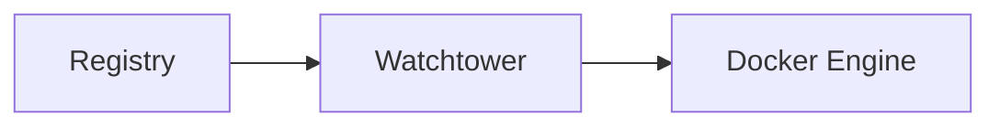

# Watchtower


    

## 🧠 Description
**Watchtower** surveille les images Docker et met à jour automatiquement les conteneurs selon un planning.

## ⚙️ Fonctions principales
- 🔄 Auto-update conteneurs
- 🧹 Cleanup images
- ⏱️ Planification
- 📣 Notifications (Shoutrrr)
- ✅ Support tags/filters

## 🔗 Intégrations
- [[Notifiarr]]

## 🧬 Flux de données


# Intégration

## Pré-requis
- Docker + Docker Compose
- Volumes persistants (recommandé)
- (Optionnel) DNS / certificats / authentification selon usage

## Docker-compose
```yaml
services:
  watchtower:
    image: containrrr/watchtower:latest
    container_name: watchtower
    restart: unless-stopped
    environment:
      - TZ=Europe/Paris
      # Planifie les updates : tous les jours à 04:00
      - WATCHTOWER_SCHEDULE=0 0 4 * * *
      - WATCHTOWER_CLEANUP=true
      - WATCHTOWER_INCLUDE_RESTARTING=true
      # Notifications (optionnel)
      # - WATCHTOWER_NOTIFICATIONS=shoutrrr
      # - WATCHTOWER_NOTIFICATION_URL=${WATCHTOWER_NOTIFICATION_URL}
    volumes:
      - /var/run/docker.sock:/var/run/docker.sock
```

# Liens externes
- GitHub : https://github.com/containrrr/watchtower
- Site : https://containrrr.dev/watchtower/

# Notes
- À compléter

# Avis de l'auteur
- À compléter
