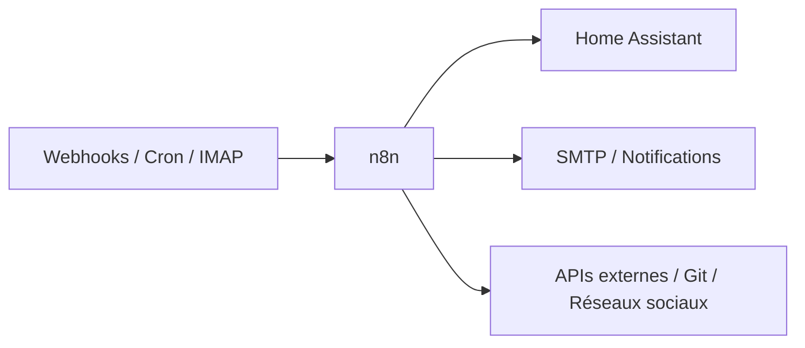

# n8n


    

## 🧠 Description
**n8n** plateforme d'automatisation de workflows avec éditeur visuel (nœuds à relier), plusieurs centaines d'intégrations et la possibilité d'injecter du code (JS/Python) quand un nœud ne suffit pas. L'alternative auto-hébergée à Zapier/Make.

> Attention : licence *fair-code* (Sustainable Use License), code source disponible mais pas open source au sens OSI. Sans impact pour un usage homelab personnel.

## ⚙️ Fonctions principales
- 🧩 Éditeur visuel de workflows (triggers, conditions, boucles)
- 🔌 400+ nœuds d'intégration + nœuds communautaires
- 🪝 Webhooks entrants/sortants
- ⏱️ Planification (cron)
- 🧠 Nœuds IA/LLM (agents, RAG) si besoin
- 👥 Gestion d'utilisateurs et credentials chiffrés

## 🧩 Nodes recommandés pour démarrer
- **Home Assistant** : nœud natif (credential = URL + long-lived access token) pour lire des états, appeler des services, déclencher des scènes — le pont domotique ↔ reste du monde.
- **HTTP Request** + **Webhook** : le couteau suisse. Toute API REST sans nœud dédié passe par là (c'est aussi la bonne façon de piloter l'API de [[Gitea]]).
- **Réseaux sociaux / messageries** : Telegram, Discord, Mastodon, X (Twitter), Reddit — publication automatique et canaux d'alerte.
- **Mail** : Send Email (SMTP) pour l'envoi, Email Trigger (IMAP) pour déclencher un workflow à la réception, Gmail/Outlook si comptes cloud.
- **Git & dev** : GitHub, GitLab, et le nœud Git pour manipuler des dépôts locaux.
- **Utilitaires** : Schedule Trigger (cron), RSS Read, Execute Command.

Les nœuds communautaires s'installent depuis l'interface : *Settings → Community nodes*.

## 🔗 Intégrations
- [[Home Assistant]]
- [[Gitea]]
- [[Notifiarr]]

## 🧬 Flux de données


# Intégration

## Pré-requis
- Docker + Docker Compose
- Volume persistant pour `/home/node/.n8n` (base SQLite, credentials, clé de chiffrement)
- Reverse proxy HTTPS recommandé (les webhooks entrants doivent être joignables via `WEBHOOK_URL`)

## Docker-compose
```yaml
services:
  n8n:
    image: docker.n8n.io/n8nio/n8n:latest
    container_name: n8n
    restart: unless-stopped
    ports:
      - "5678:5678"
    environment:
      - TZ=Europe/Paris
      - GENERIC_TIMEZONE=Europe/Paris
      # Derrière un reverse proxy, indispensable pour des webhooks corrects :
      - N8N_HOST=n8n.mondomaine.tld
      - WEBHOOK_URL=https://n8n.mondomaine.tld/
    volumes:
      - ./n8n/data:/home/node/.n8n
```

# Liens externes
- GitHub : https://github.com/n8n-io/n8n
- Site : https://n8n.io/
- Documentation : https://docs.n8n.io/

# Notes
- Premier lancement : création du compte propriétaire via l'interface web.
- La **clé de chiffrement des credentials** est générée dans le volume (`.n8n/config`) : sans elle, impossible de déchiffrer les credentials restaurés — elle fait partie intégrante de la sauvegarde.
- SQLite par défaut, largement suffisant en homelab ; PostgreSQL possible via variables `DB_TYPE=postgresdb` + `DB_POSTGRESDB_*` pour un usage intensif.
- Les workflows s'exportent/importent en JSON : pratique pour les versionner dans un dépôt Git.
- Le conteneur tourne avec l'utilisateur `node` (UID 1000) : adapter le propriétaire du volume si besoin (`chown -R 1000:1000 ./n8n/data`).

# Avis de l'auteur
- À compléter
