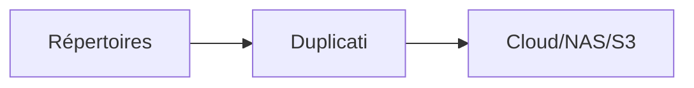

# Duplicati


    

## 🧠 Description
**Duplicati** solution de sauvegarde chiffrée avec déduplication (destinations : S3, WebDAV, SSH, etc.).

## ⚙️ Fonctions principales
- 🔒 Chiffrement
- 🧠 Déduplication
- ⏱️ Planification
- ☁️ Destinations multiples
- ♻️ Rétention

## 🔗 Intégrations
- [[Syncthing]]

## 🧬 Flux de données


# Intégration

## Pré-requis
- Docker + Docker Compose
- Volumes persistants (recommandé)
- (Optionnel) DNS / certificats / authentification selon usage

## Docker-compose
```yaml
services:
  duplicati:
    image: lscr.io/linuxserver/duplicati:latest
    container_name: duplicati
    restart: unless-stopped
    environment:
      - PUID=1000
      - PGID=1000
      - TZ=Europe/Paris
    ports:
      - "8200:8200"
    volumes:
      - ./duplicati/config:/config
      - ./duplicati/backups:/backups
      - ./duplicati/source:/source:ro
```

# Liens externes
- GitHub : https://github.com/duplicati/duplicati
- Site : https://www.duplicati.com

# Notes
- À compléter

# Avis de l'auteur
- À compléter
