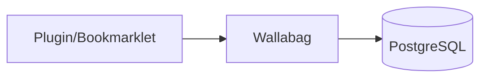

# Wallabag


    

## 🧠 Description
**Wallabag** outil “read-it-later” pour sauvegarder des articles, les annoter et les lire hors-ligne.

## ⚙️ Fonctions principales
- 📌 Sauvegarde d’articles
- 🧼 Nettoyage du contenu
- 🏷️ Tags
- 📤 Export
- 📱 Apps/clients

## 🔗 Intégrations
- [[NGINX]]
- [[Keycloak]]

## 🧬 Flux de données


# Intégration

## Pré-requis
- Docker + Docker Compose
- Volumes persistants (recommandé)
- (Optionnel) DNS / certificats / authentification selon usage

## Docker-compose
```yaml
services:
  wallabag-db:
    image: postgres:16
    container_name: wallabag-db
    restart: unless-stopped
    environment:
      - POSTGRES_DB=wallabag
      - POSTGRES_USER=adrientanaka
      - POSTGRES_PASSWORD=${WALLABAG_DB_PASSWORD:-CHANGE_ME_DB_PASSWORD}
    volumes:
      - ./wallabag/postgres:/var/lib/postgresql/data

  wallabag:
    image: wallabag/wallabag:latest
    container_name: wallabag
    restart: unless-stopped
    depends_on:
      - wallabag-db
    ports:
      - "8089:80"
    environment:
      - SYMFONY__ENV__DATABASE_DRIVER=pdo_pgsql
      - SYMFONY__ENV__DATABASE_HOST=wallabag-db
      - SYMFONY__ENV__DATABASE_PORT=5432
      - SYMFONY__ENV__DATABASE_NAME=wallabag
      - SYMFONY__ENV__DATABASE_USER=adrientanaka
      - SYMFONY__ENV__DATABASE_PASSWORD=${WALLABAG_DB_PASSWORD:-CHANGE_ME_DB_PASSWORD}
      - SYMFONY__ENV__DOMAIN_NAME=http://localhost:8089
      - TZ=Europe/Paris
    volumes:
      - ./wallabag/images:/var/www/wallabag/web/assets/images
```

# Liens externes
- GitHub : https://github.com/wallabag/wallabag
- Site : https://wallabag.org

# Notes
- À compléter

# Avis de l'auteur
- À compléter
