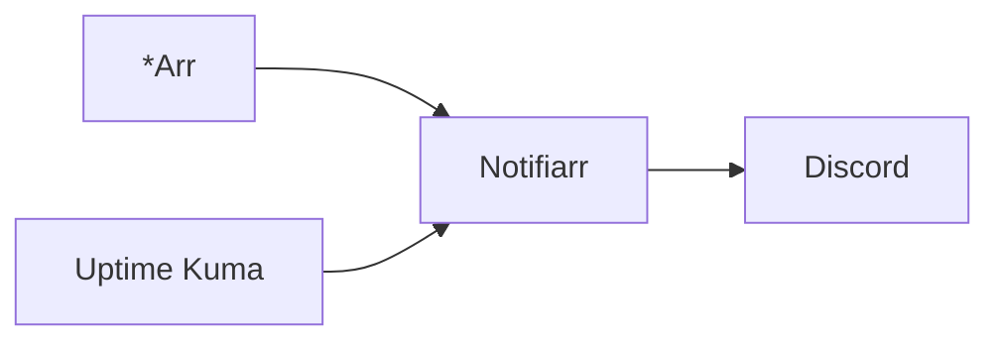

# Notifiarr


    

## 🧠 Description
**Notifiarr** hub de notifications (souvent Discord) et d’intégrations pour les *Arr et l’infra.

## ⚙️ Fonctions principales
- 📣 Notifications centralisées
- 🔗 Intégrations *Arr
- 📊 Monitoring léger
- ⚙️ Webhooks
- 🧩 Utilitaire homelab

## 🔗 Intégrations
- [[Sonarr]]
- [[Radarr]]
- [[Uptime Kuma]]
- [[Watchtower]]

## 🧬 Flux de données


# Intégration

## Pré-requis
- Docker + Docker Compose
- Volumes persistants (recommandé)
- (Optionnel) DNS / certificats / authentification selon usage

## Docker-compose
```yaml
services:
  notifiarr:
    image: golift/notifiarr:latest
    container_name: notifiarr
    restart: unless-stopped
    environment:
      - TZ=Europe/Paris
      # Token Notifiarr (Discord) : à générer côté Notifiarr.com
      - DN_API_KEY=${NOTIFIARR_API_KEY:-CHANGE_ME_API_KEY}
    ports:
      - "5454:5454"
    volumes:
      - ./notifiarr/config:/config
```

# Liens externes
- GitHub : https://github.com/Notifiarr/notifiarr
- Site : https://notifiarr.com/

# Notes
- À compléter

# Avis de l'auteur
- À compléter
