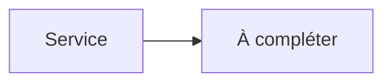

# AdGuard Home


    

## 🧠 Description
**AdGuard Home** DNS filtrant (pubs/trackers) avec interface d’administration, idéal en homelab.

## ⚙️ Fonctions principales
- 🛡️ Blocage pubs/trackers
- 🧾 Logs DNS
- 📋 Listes & règles
- 🔐 DoH/DoT (selon config)
- 👨‍👩‍👧‍👦 Profils/clients (selon config)

## 🔗 Intégrations
- [[Uptime Kuma]]

## 🧬 Flux de données


# Intégration

## Pré-requis
- Docker + Docker Compose
- DNS/ports ouverts selon l’usage
- (Optionnel) Base de données selon le service (voir ci-dessous)

## Docker-compose
```yaml
services:
  adguardhome:
    image: adguard/adguardhome:latest
    container_name: adguardhome
    restart: unless-stopped
    ports:
      - "3000:3000"        # UI d'admin
      - "53:53/tcp"
      - "53:53/udp"
    volumes:
      - ./adguardhome/work:/opt/adguardhome/work
      - ./adguardhome/conf:/opt/adguardhome/conf
```

# Liens externes
- GitHub : https://github.com/AdguardTeam/AdGuardHome
- Site : https://adguard.com/en/adguard-home/overview.html

# Notes
- À compléter

# Avis de l'auteur
- À compléter
