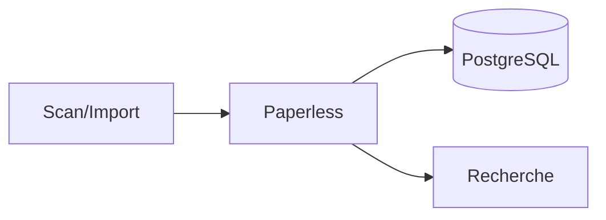

# Paperless-ngx


    

## 🧠 Description
**Paperless-ngx** GED personnelle : ingestion (scan/email), OCR, tags, recherche, et organisation de documents.

## ⚙️ Fonctions principales
- 📥 Ingestion (consume)
- 🔎 OCR + recherche
- 🏷️ Tags/Correspondants
- 📦 Export
- 🧩 API

## 🔗 Intégrations
- [[Elasticsearch]]
- [[NextCloud]]

## 🧬 Flux de données


# Intégration

## Pré-requis
- Docker + Docker Compose
- Volumes persistants (recommandé)
- (Optionnel) DNS / certificats / authentification selon usage

## Docker-compose
```yaml
services:
  paperless-db:
    image: postgres:16
    container_name: paperless-db
    restart: unless-stopped
    environment:
      - POSTGRES_DB=paperless
      - POSTGRES_USER=adrientanaka
      - POSTGRES_PASSWORD=${PAPERLESS_DB_PASSWORD:-CHANGE_ME_DB_PASSWORD}
    volumes:
      - ./paperless/postgres:/var/lib/postgresql/data

  paperless-broker:
    image: redis:7-alpine
    container_name: paperless-redis
    restart: unless-stopped
    volumes:
      - ./paperless/redis:/data

  paperless:
    image: ghcr.io/paperless-ngx/paperless-ngx:latest
    container_name: paperless-ngx
    restart: unless-stopped
    depends_on:
      - paperless-db
      - paperless-broker
    ports:
      - "8000:8000"
    environment:
      - PAPERLESS_REDIS=redis://paperless-broker:6379
      - PAPERLESS_DBHOST=paperless-db
      - PAPERLESS_DBNAME=paperless
      - PAPERLESS_DBUSER=adrientanaka
      - PAPERLESS_DBPASS=${PAPERLESS_DB_PASSWORD:-CHANGE_ME_DB_PASSWORD}
      # Génère un secret : openssl rand -hex 32
      - PAPERLESS_SECRET_KEY=${PAPERLESS_SECRET_KEY:-CHANGE_ME_SECRET_KEY}
      - PAPERLESS_TIME_ZONE=Europe/Paris
      - PAPERLESS_URL=http://localhost:8000
    volumes:
      - ./paperless/data:/usr/src/paperless/data
      - ./paperless/media:/usr/src/paperless/media
      - ./paperless/export:/usr/src/paperless/export
      - ./paperless/consume:/usr/src/paperless/consume
```

# Liens externes
- GitHub : https://github.com/paperless-ngx/paperless-ngx
- Site : https://docs.paperless-ngx.com/

# Notes
- À compléter

# Avis de l'auteur
- À compléter
