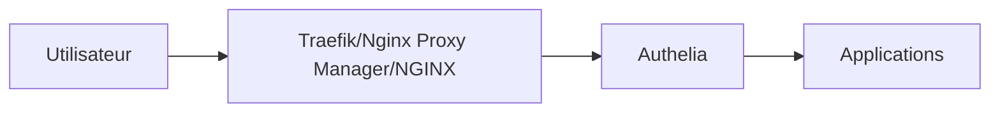

# Authelia


    

## 🧠 Description
**Authelia** fournit une authentification forte (2FA/MFA) et un SSO léger pour protéger des applications derrière un reverse-proxy.

## ⚙️ Fonctions principales
- 🔐 2FA/MFA (TOTP/WebAuthn selon config)
- 🧾 Politiques d’accès
- 🔗 SSO (OIDC selon versions/config)
- 🧩 Intégration reverse-proxy
- 📋 Logs & audit de base

## 🔗 Intégrations
- [[Traefik]]
- [[Nginx Proxy Manager]]
- [[NGINX]]

## 🧬 Flux de données


# Intégration

## Pré-requis
- Docker + Docker Compose
- DNS/ports ouverts selon l’usage
- (Optionnel) Base de données selon le service (voir ci-dessous)

## Docker-compose
```yaml
services:
  authelia:
    image: authelia/authelia:latest
    container_name: authelia
    restart: unless-stopped
    environment:
      - TZ=Europe/Paris
      # Génère une JWT secret : openssl rand -hex 32
      - AUTHELIA_JWT_SECRET=${AUTHELIA_JWT_SECRET:-CHANGE_ME_JWT_SECRET}
    ports:
      - "9091:9091"
    volumes:
      - ./authelia/config:/config
      - ./authelia/data:/var/lib/authelia
```

# Liens externes
- GitHub : https://github.com/authelia/authelia
- Site : https://www.authelia.com

# Notes
- À compléter

# Avis de l'auteur
- À compléter
