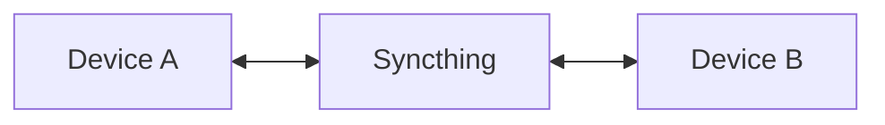

# Syncthing


    

## 🧠 Description
**Syncthing** synchronisation P2P chiffrée entre machines (dossiers, versions, peer discovery).

## ⚙️ Fonctions principales
- 🔁 Sync bidirectionnelle
- 🔒 Chiffrement
- 🧾 Versions fichiers
- 🌐 Discovery
- 🖥️ UI

## 🔗 Intégrations
- [[NextCloud]]
- [[Duplicati]]

## 🧬 Flux de données


# Intégration

## Pré-requis
- Docker + Docker Compose
- Volumes persistants (recommandé)
- (Optionnel) DNS / certificats / authentification selon usage

## Docker-compose
```yaml
services:
  syncthing:
    image: lscr.io/linuxserver/syncthing:latest
    container_name: syncthing
    restart: unless-stopped
    environment:
      - PUID=1000
      - PGID=1000
      - TZ=Europe/Paris
    ports:
      - "8384:8384"        # UI
      - "22000:22000/tcp"  # Sync
      - "22000:22000/udp"
      - "21027:21027/udp"  # Discovery
    volumes:
      - ./syncthing/config:/config
      - ./syncthing/data:/data
```

# Liens externes
- GitHub : https://github.com/syncthing/syncthing
- Site : https://syncthing.net

# Notes
- À compléter

# Avis de l'auteur
- À compléter
