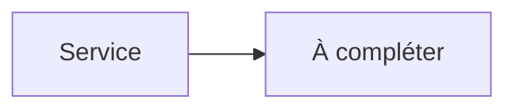

# Transmission


    

## 🧠 Description
**Transmission** Client BitTorrent léger et stable, contrôlable via interface web et RPC.

## ⚙️ Fonctions principales
- ⬇️ Téléchargement torrents
- 🌐 Web UI
- 🧲 Magnet links
- 📁 Watch folder
- 🔌 RPC

## 🔗 Intégrations
- [[Sonarr]]
- [[Radarr]]
- [[Lidarr]]
- [[Readarr]]

## 🧬 Flux de données


# Intégration

## Pré-requis
- Docker + Docker Compose
- Accès réseau aux services intégrés (ex: [[Prowlarr]], [[Transmission]], [[Jellyfin]]…)
- (Optionnel) Stockage persistant (NAS, ZFS, etc.)

## Docker-compose
```yaml
services:
  transmission:
    image: lscr.io/linuxserver/transmission:latest
    container_name: transmission
    restart: unless-stopped
    environment:
      - PUID=1000
      - PGID=1000
      - TZ=Europe/Paris
      - USER=adrientanaka
      # Génère un mot de passe fort : openssl rand -base64 32
      - PASS=${TRANSMISSION_PASS:-CHANGE_ME_STRONG_PASSWORD}
    ports:
      - "9091:9091"
      - "51413:51413"
      - "51413:51413/udp"
    volumes:
      - ./transmission/config:/config
      - ./transmission/downloads:/downloads
      - ./transmission/data:/watch
```

# Liens externes
- GitHub : https://github.com/transmission/transmission
- Site : https://transmissionbt.com

# Notes
- À compléter (bonnes pratiques, profils TRaSH, hardlinks, permissions, etc.)

# Avis de l'auteur
- À compléter
