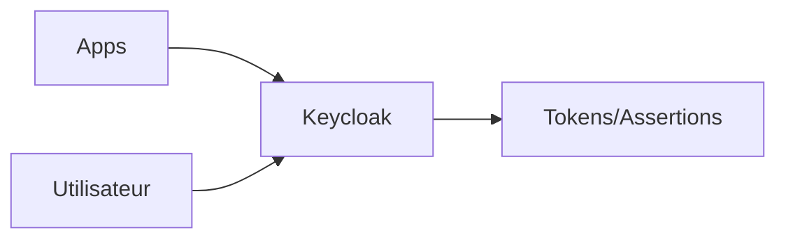

# Keycloak


    

## 🧠 Description
**Keycloak** plateforme IAM complète (SSO, OIDC/SAML, gestion utilisateurs/roles) adaptée aux stacks homelab comme pro.

## ⚙️ Fonctions principales
- 🪪 SSO (OIDC/SAML)
- 👥 Gestion utilisateurs & groupes
- 🧩 Clients/applications
- 🔐 MFA & politiques
- 📜 Audit/événements

## 🔗 Intégrations
- [[Grafana]]
- [[Guacamole]]
- [[NextCloud]]

## 🧬 Flux de données


# Intégration

## Pré-requis
- Docker + Docker Compose
- DNS/ports ouverts selon l’usage
- (Optionnel) Base de données selon le service (voir ci-dessous)

## Docker-compose
```yaml
services:
  keycloak-db:
    image: postgres:16
    container_name: keycloak-db
    restart: unless-stopped
    environment:
      - POSTGRES_DB=keycloak
      - POSTGRES_USER=adrientanaka
      # Génère un mot de passe : openssl rand -base64 32
      - POSTGRES_PASSWORD=${KEYCLOAK_DB_PASSWORD:-CHANGE_ME_DB_PASSWORD}
    volumes:
      - ./keycloak/postgres:/var/lib/postgresql/data

  keycloak:
    image: quay.io/keycloak/keycloak:latest
    container_name: keycloak
    restart: unless-stopped
    depends_on:
      - keycloak-db
    command: ["start"]
    environment:
      - KC_DB=postgres
      - KC_DB_URL_HOST=keycloak-db
      - KC_DB_URL_DATABASE=keycloak
      - KC_DB_USERNAME=adrientanaka
      - KC_DB_PASSWORD=${KEYCLOAK_DB_PASSWORD:-CHANGE_ME_DB_PASSWORD}
      - KC_HOSTNAME_STRICT=false
      # Admin bootstrap (à changer après 1ère connexion)
      - KEYCLOAK_ADMIN=adrientanaka
      - KEYCLOAK_ADMIN_PASSWORD=${KEYCLOAK_ADMIN_PASSWORD:-CHANGE_ME_ADMIN_PASSWORD}
    ports:
      - "8080:8080"
    volumes:
      - ./keycloak/data:/opt/keycloak/data
```

# Liens externes
- GitHub : https://github.com/keycloak/keycloak
- Site : https://www.keycloak.org

# Notes
- À compléter

# Avis de l'auteur
- À compléter
