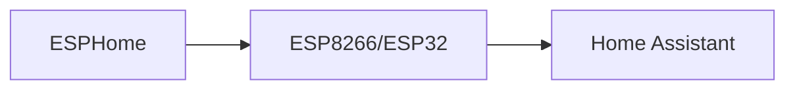

# ESPHome


    

## 🧠 Description
**ESPHome** outil de génération de firmware pour ESP8266/ESP32 avec config YAML, très intégré à Home Assistant.

## ⚙️ Fonctions principales
- 🧱 Firmware YAML
- 🔌 Intégration Home Assistant
- 📡 OTA updates
- 🧪 Logs & diagnostics
- ⚙️ Templates

## 🔗 Intégrations
- [[Home Assistant]]

## 🧬 Flux de données


# Intégration

## Pré-requis
- Docker + Docker Compose
- Accès au matériel si nécessaire (ex: USB, GPIO, etc.)
- Volumes persistants (recommandé)

## Docker-compose
```yaml
services:
  esphome:
    image: ghcr.io/esphome/esphome:latest
    container_name: esphome
    restart: unless-stopped
    environment:
      - TZ=Europe/Paris
    ports:
      - "6052:6052"
    volumes:
      - ./esphome/config:/config
      # Accès USB série si flash direct (adapter):
      # - /dev/ttyUSB0:/dev/ttyUSB0
```

# Liens externes
- GitHub : https://github.com/esphome/esphome
- Site : https://esphome.io/

# Notes
- À compléter

# Avis de l'auteur
- À compléter
