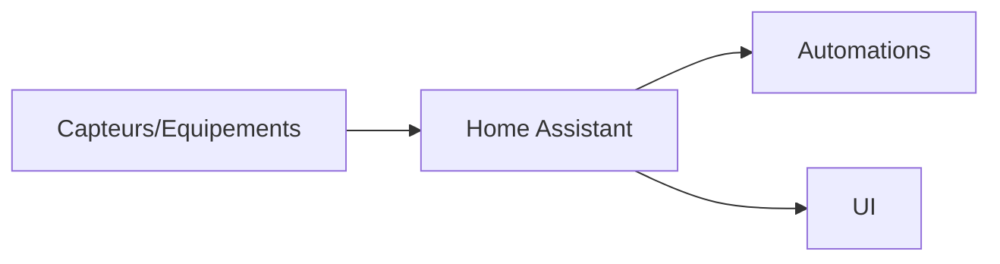

# Home Assistant


    

## 🧠 Description
**Home Assistant** plateforme domotique (automations, intégrations, tableaux de bord) pour centraliser capteurs et équipements.

## ⚙️ Fonctions principales
- 🏠 Automations
- 🔌 Intégrations (Zigbee/Z-Wave/cloud)
- 📊 Dashboards
- 🧩 Add-ons (selon install)
- 📜 Historique & logs

## 🔗 Intégrations
- [[ESPHome]]
- [[AdGuard Home]]
- [[Prometheus]]

## 🧬 Flux de données



# Intégration

## Pré-requis
- Docker + Docker Compose
- Accès au matériel si nécessaire (ex: USB, GPIO, etc.)
- Volumes persistants (recommandé)

## Docker-compose
```yaml
services:
  homeassistant:
    image: ghcr.io/home-assistant/home-assistant:stable
    container_name: homeassistant
    restart: unless-stopped
    network_mode: host
    privileged: true
    environment:
      - TZ=Europe/Paris
    volumes:
      - ./home-assistant/config:/config
      # (Optionnel) DB externe recommandée à terme (MariaDB/Postgres)
```

# Liens externes
- GitHub : https://github.com/home-assistant/core
- Site : https://www.home-assistant.io/

# Notes
- À compléter

# Avis de l'auteur
- À compléter
