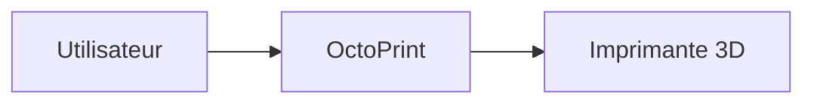

# OctoPrint


    

## 🧠 Description
**OctoPrint** contrôle et supervision d’imprimantes 3D (upload gcode, suivi, webcam, plugins).

## ⚙️ Fonctions principales
- 🖨️ Contrôle imprimante 3D
- 📤 Upload G-code
- 📷 Webcam
- 🧩 Plugins
- 📈 Monitoring impression

## 🔗 Intégrations
- [[Home Assistant]]

## 🧬 Flux de données


# Intégration

## Pré-requis
- Docker + Docker Compose
- Accès au matériel si nécessaire (ex: USB, GPIO, etc.)
- Volumes persistants (recommandé)

## Docker-compose
```yaml
services:
  octoprint:
    image: octoprint/octoprint:latest
    container_name: octoprint
    restart: unless-stopped
    ports:
      - "5000:80"
    environment:
      - TZ=Europe/Paris
    volumes:
      - ./octoprint/config:/octoprint
    devices:
      # Adaptation : port série de l'imprimante
      # - /dev/ttyUSB0:/dev/ttyUSB0
      # (Optionnel) Webcam:
      # - /dev/video0:/dev/video0
```

# Liens externes
- GitHub : https://github.com/OctoPrint/OctoPrint
- Site : https://octoprint.org/

# Notes
- À compléter

# Avis de l'auteur
- À compléter
