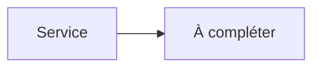

# Jellyseerr


    

## 🧠 Description
**Jellyseerr** Portail de demandes pour Jellyfin/Emby, connecté à Sonarr/Radarr.

## ⚙️ Fonctions principales
- 🙋 Portail demandes
- 👥 Comptes utilisateurs (SSO possible)
- 🔗 Envoi vers Sonarr/Radarr
- 📣 Notifications
- 🧩 API

## 🔗 Intégrations
- [[Sonarr]]
- [[Radarr]]
- [[Jellyfin]]

## 🧬 Flux de données


# Intégration

## Pré-requis
- Docker + Docker Compose
- Accès réseau aux services intégrés (ex: [[Prowlarr]], [[Transmission]], [[Jellyfin]]…)
- (Optionnel) Stockage persistant (NAS, ZFS, etc.)

## Docker-compose
```yaml
services:
  jellyseerr:
    image: fallenbagel/jellyseerr:latest
    container_name: jellyseerr
    restart: unless-stopped
    environment:
      - TZ=Europe/Paris
    ports:
      - "5055:5055"
    volumes:
      - ./jellyseerr/config:/app/config
```

# Liens externes
- GitHub : https://github.com/Fallenbagel/jellyseerr
- Site : https://github.com/Fallenbagel/jellyseerr

# Notes
- À compléter (bonnes pratiques, profils TRaSH, hardlinks, permissions, etc.)

# Avis de l'auteur
- À compléter
