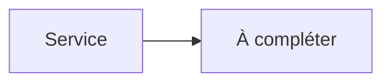

# Overseerr


    

## 🧠 Description
**Overseerr** Portail de demandes pour Plex (et parfois Jellyfin), connecté à Sonarr/Radarr.

## ⚙️ Fonctions principales
- 🙋 Portail demandes Plex
- 🔗 Envoi vers Sonarr/Radarr
- 👥 Gestion utilisateurs
- 📣 Notifications
- 🧩 API

## 🔗 Intégrations
- [[Sonarr]]
- [[Radarr]]
- [[Plex Media Server]]

## 🧬 Flux de données


# Intégration

## Pré-requis
- Docker + Docker Compose
- Accès réseau aux services intégrés (ex: [[Prowlarr]], [[Transmission]], [[Jellyfin]]…)
- (Optionnel) Stockage persistant (NAS, ZFS, etc.)

## Docker-compose
```yaml
services:
  overseerr:
    image: sctx/overseerr:latest
    container_name: overseerr
    restart: unless-stopped
    environment:
      - TZ=Europe/Paris
      # Génère une clé de chiffrement : openssl rand -hex 32
      - SECRET_KEY=${OVERSEERR_SECRET_KEY:-CHANGE_ME_SECRET_KEY}
    ports:
      - "5055:5055"
    volumes:
      - ./overseerr/config:/app/config
```

# Liens externes
- GitHub : https://github.com/sct/overseerr
- Site : https://overseerr.dev

# Notes
- À compléter (bonnes pratiques, profils TRaSH, hardlinks, permissions, etc.)

# Avis de l'auteur
- À compléter
