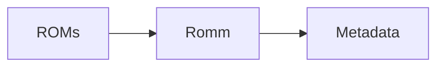

# Romm


    

## 🧠 Description
**Romm** gestionnaire de bibliothèque de ROMs (métadonnées, scan, organisation) pour retrogaming.

## ⚙️ Fonctions principales
- 🎮 Gestion ROMs
- 🏷️ Métadonnées
- 🔎 Recherche
- 📁 Organisation
- 🧩 UI web

## 🔗 Intégrations
- [[Dashy]]

## 🧬 Flux de données


# Intégration

## Pré-requis
- Docker + Docker Compose
- Volumes persistants (recommandé)
- (Optionnel) DNS / certificats / authentification selon usage

## Docker-compose
```yaml
services:
  romm:
    image: rommapp/romm:latest
    container_name: romm
    restart: unless-stopped
    ports:
      - "3003:3000"
    environment:
      - TZ=Europe/Paris
      # Génère un secret : openssl rand -hex 32
      - ROMM_SECRET_KEY=${ROMM_SECRET_KEY:-CHANGE_ME_SECRET_KEY}
    volumes:
      - ./romm/config:/config
      - ./romm/library:/library
      - ./romm/assets:/assets
```

# Liens externes
- GitHub : https://github.com/rommapp/romm
- Site : https://romm.app

# Notes
- À compléter

# Avis de l'auteur
- À compléter
