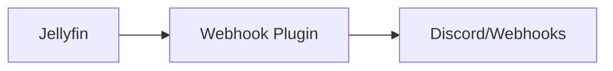

# Jellyfin-webhook-plugin


    

## 🧠 Description
**Jellyfin-webhook-plugin** plugin Jellyfin permettant d’émettre des webhooks (Discord, HTTP, etc.) sur des événements de lecture.

## ⚙️ Fonctions principales
- 🔔 Webhooks événements Jellyfin
- 🌐 HTTP/Discord
- ⚙️ Templates
- 🧩 Installation via catalogue plugins
- 🧾 Debug/logs

## 🔗 Intégrations
- [[Jellyfin]]
- [[Notifiarr]]

## 🧬 Flux de données


# Intégration

## Pré-requis
- Docker + Docker Compose
- Accès au matériel si nécessaire (ex: USB, GPIO, etc.)
- Volumes persistants (recommandé)

## Docker-compose
```yaml
# Jellyfin-webhook-plugin s'installe comme plugin DANS Jellyfin (pas un service à part).
# Ici un exemple de stack Jellyfin + un volume plugins persistant.

services:
  jellyfin:
    image: jellyfin/jellyfin:latest
    container_name: jellyfin
    restart: unless-stopped
    user: "1000:1000"
    ports:
      - "8096:8096"
    volumes:
      - ./jellyfin/config:/config
      - ./jellyfin/cache:/cache
      - ./jellyfin/media:/media
      - ./jellyfin/plugins:/config/plugins
    environment:
      - TZ=Europe/Paris
```

# Liens externes
- GitHub : https://github.com/jellyfin/jellyfin-plugin-webhook
- Site : https://github.com/jellyfin/jellyfin-plugin-webhook

# Notes
- À compléter

# Avis de l'auteur
- À compléter
