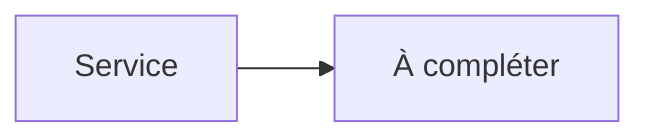

# Jellyfin


    

## 🧠 Description
**Jellyfin** Serveur multimédia open-source pour streamer films, séries, musique et photos.

## ⚙️ Fonctions principales
- 📺 Streaming multi-clients
- 👤 Comptes & accès
- 🎞️ Transcodage
- 📚 Métadonnées
- 🔌 Plugins

## 🔗 Intégrations
- [[Sonarr]]
- [[Radarr]]
- [[Bazarr]]
- [[Jellystat]]

## 🧬 Flux de données


# Intégration

## Pré-requis
- Docker + Docker Compose
- Accès réseau aux services intégrés (ex: [[Prowlarr]], [[Transmission]], [[Jellyfin]]…)
- (Optionnel) Stockage persistant (NAS, ZFS, etc.)

## Docker-compose
```yaml
services:
  jellyfin:
    image: jellyfin/jellyfin:latest
    container_name: jellyfin
    restart: unless-stopped
    user: "1000:1000"
    ports:
      - "8096:8096"
    volumes:
      - ./jellyfin/config:/config
      - ./jellyfin/cache:/cache
      - ./jellyfin/media:/media
    environment:
      - TZ=Europe/Paris
```

# Liens externes
- GitHub : https://github.com/jellyfin/jellyfin
- Site : https://jellyfin.org

# Notes
- À compléter (bonnes pratiques, profils TRaSH, hardlinks, permissions, etc.)

# Avis de l'auteur
- À compléter
