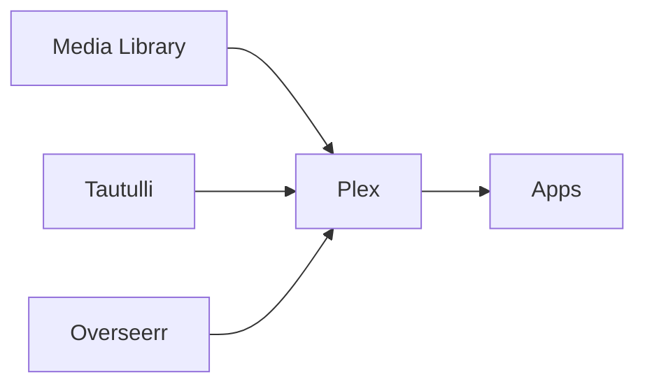

# Plex Media Server


    

## 🧠 Description
**Plex Media Server** serveur multimédia propriétaire (freemium) pour streamer et gérer films/séries/musique, avec clients très répandus.

## ⚙️ Fonctions principales
- 📺 Streaming multi-clients
- 🎞️ Transcodage
- 📚 Métadonnées
- 👥 Gestion utilisateurs
- 🔌 Apps/clients

## 🔗 Intégrations
- [[Overseerr]]
- [[Tautulli]]

## 🧬 Flux de données


# Intégration

## Pré-requis
- Docker + Docker Compose
- Accès au matériel si nécessaire (ex: USB, GPIO, etc.)
- Volumes persistants (recommandé)

## Docker-compose
```yaml
services:
  plex:
    image: lscr.io/linuxserver/plex:latest
    container_name: plex
    restart: unless-stopped
    network_mode: host
    environment:
      - PUID=1000
      - PGID=1000
      - TZ=Europe/Paris
      # Claim (optionnel) : https://www.plex.tv/claim/
      - PLEX_CLAIM=${PLEX_CLAIM:-}
    volumes:
      - ./plex/config:/config
      - ./plex/media:/media
      - ./plex/transcode:/transcode
```

# Liens externes
- GitHub : https://github.com/plexinc/pms-docker
- Site : https://www.plex.tv/

# Notes
- À compléter

# Avis de l'auteur
- À compléter
