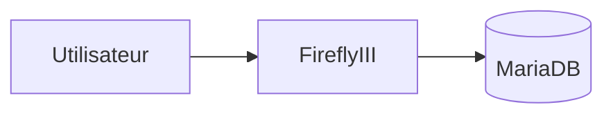

# Firefly III


    

## 🧠 Description
**Firefly III** gestion financière personnelle (budget, catégories, transactions, rapports) auto-hébergée.

## ⚙️ Fonctions principales
- 💶 Comptes & transactions
- 🏷️ Budgets/catégories
- 📈 Rapports
- 📤 Import/Export
- 🧩 API

## 🔗 Intégrations
- (à compléter)

## 🧬 Flux de données


# Intégration

## Pré-requis
- Docker + Docker Compose
- Volumes persistants (recommandé)
- (Optionnel) DNS / certificats / authentification selon usage

## Docker-compose
```yaml
services:
  firefly-db:
    image: mariadb:11
    container_name: firefly-db
    restart: unless-stopped
    environment:
      - MYSQL_DATABASE=firefly
      - MYSQL_USER=adrientanaka
      - MYSQL_PASSWORD=${FIREFLY_DB_PASSWORD:-CHANGE_ME_DB_PASSWORD}
      - MYSQL_ROOT_PASSWORD=${FIREFLY_ROOT_PASSWORD:-CHANGE_ME_ROOT_PASSWORD}
    volumes:
      - ./firefly/mariadb:/var/lib/mysql

  firefly:
    image: fireflyiii/core:latest
    container_name: firefly
    restart: unless-stopped
    depends_on:
      - firefly-db
    ports:
      - "8090:8080"
    environment:
      - APP_KEY=${FIREFLY_APP_KEY:-CHANGE_ME_APP_KEY}
      - TZ=Europe/Paris
      - DB_CONNECTION=mysql
      - DB_HOST=firefly-db
      - DB_PORT=3306
      - DB_DATABASE=firefly
      - DB_USERNAME=adrientanaka
      - DB_PASSWORD=${FIREFLY_DB_PASSWORD:-CHANGE_ME_DB_PASSWORD}
    volumes:
      - ./firefly/upload:/var/www/html/storage/upload
```

# Liens externes
- GitHub : https://github.com/firefly-iii/firefly-iii
- Site : https://www.firefly-iii.org

# Notes
- À compléter

# Avis de l'auteur
- À compléter
