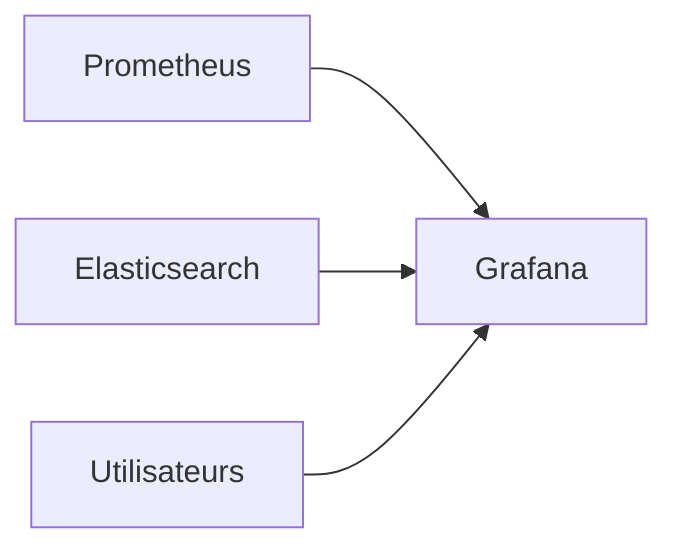

# Grafana


    

## 🧠 Description
**Grafana** plateforme de visualisation/observabilité (dashboards, alerting) compatible avec de nombreuses sources (Prometheus, Elasticsearch, etc.).

## ⚙️ Fonctions principales
- 📊 Dashboards
- 🔔 Alerting
- 🔌 Datasources multiples
- 👥 Gestion utilisateurs
- ⚙️ Provisioning as code

## 🔗 Intégrations
- [[Prometheus]]
- [[Elasticsearch]]
- [[Keycloak]]

## 🧬 Flux de données


# Intégration

## Pré-requis
- Docker + Docker Compose
- Volumes persistants (recommandé)
- (Optionnel) DNS / certificats / authentification selon usage

## Docker-compose
```yaml
services:
  grafana:
    image: grafana/grafana-oss:latest
    container_name: grafana
    restart: unless-stopped
    user: "1000:1000"
    environment:
      - GF_SECURITY_ADMIN_USER=adrientanaka
      # Génère un mot de passe : openssl rand -base64 32
      - GF_SECURITY_ADMIN_PASSWORD=${GRAFANA_ADMIN_PASSWORD:-CHANGE_ME_ADMIN_PASSWORD}
      - GF_USERS_ALLOW_SIGN_UP=false
      - TZ=Europe/Paris
    ports:
      - "3001:3000"
    volumes:
      - ./grafana/data:/var/lib/grafana
      - ./grafana/provisioning:/etc/grafana/provisioning
```

# Liens externes
- GitHub : https://github.com/grafana/grafana
- Site : https://grafana.com/

# Notes
- À compléter

# Avis de l'auteur
- À compléter
