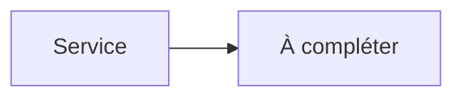

# Jellystat


    

## 🧠 Description
**Jellystat** Statistiques et analytics pour Jellyfin (équivalent “Tautulli” côté Jellyfin).

## ⚙️ Fonctions principales
- 📊 Stats utilisateurs
- ⏱️ Historique de lecture
- 📈 Tableaux/graphes
- 🟢 Activité
- 🧩 API

## 🔗 Intégrations
- [[Jellyfin]]

## 🧬 Flux de données


# Intégration

## Pré-requis
- Docker + Docker Compose
- Accès réseau aux services intégrés (ex: [[Prowlarr]], [[Transmission]], [[Jellyfin]]…)
- (Optionnel) Stockage persistant (NAS, ZFS, etc.)

## Docker-compose
```yaml
services:
  jellystat:
    image: cyfershepard/jellystat:latest
    container_name: jellystat
    restart: unless-stopped
    environment:
      - TZ=Europe/Paris
    ports:
      - "3000:3000"
    volumes:
      - ./jellystat/data:/app/backend/data
```

# Liens externes
- GitHub : https://github.com/CyferShepard/Jellystat
- Site : https://github.com/CyferShepard/Jellystat

# Notes
- À compléter (bonnes pratiques, profils TRaSH, hardlinks, permissions, etc.)

# Avis de l'auteur
- À compléter
