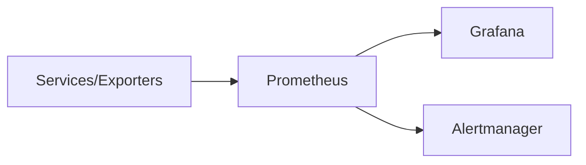

# Prometheus


    

## 🧠 Description
**Prometheus** collecte des métriques (time-series) depuis des cibles (exporters) et permet d’alerter via des règles.

## ⚙️ Fonctions principales
- 📈 Collecte métriques
- 🧠 PromQL
- 🚨 Alerting (via Alertmanager)
- 🧩 Exporters
- 🗄️ Stockage TSDB

## 🔗 Intégrations
- [[Grafana]]
- [[Uptime Kuma]]

## 🧬 Flux de données


# Intégration

## Pré-requis
- Docker + Docker Compose
- Volumes persistants (recommandé)
- (Optionnel) DNS / certificats / authentification selon usage

## Docker-compose
```yaml
services:
  prometheus:
    image: prom/prometheus:latest
    container_name: prometheus
    restart: unless-stopped
    user: "1000:1000"
    ports:
      - "9090:9090"
    volumes:
      - ./prometheus/config:/etc/prometheus:ro
      - ./prometheus/data:/prometheus
    command:
      - --config.file=/etc/prometheus/prometheus.yml
      - --storage.tsdb.path=/prometheus
      - --web.enable-lifecycle=true
```

# Liens externes
- GitHub : https://github.com/prometheus/prometheus
- Site : https://prometheus.io/

# Notes
- À compléter

# Avis de l'auteur
- À compléter
