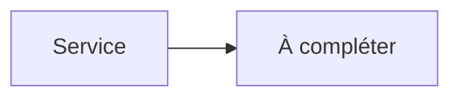

# Tautulli


    

## 🧠 Description
**Tautulli** Statistiques, monitoring et historique de lecture pour Plex Media Server.

## ⚙️ Fonctions principales
- 📊 Stats Plex
- ⏱️ Historique de lecture
- 👥 Activité utilisateurs
- 📣 Notifications
- 🧩 API

## 🔗 Intégrations
- [[Plex Media Server]]

## 🧬 Flux de données


# Intégration

## Pré-requis
- Docker + Docker Compose
- Accès réseau aux services intégrés (ex: [[Prowlarr]], [[Transmission]], [[Jellyfin]]…)
- (Optionnel) Stockage persistant (NAS, ZFS, etc.)

## Docker-compose
```yaml
services:
  tautulli:
    image: lscr.io/linuxserver/tautulli:latest
    container_name: tautulli
    restart: unless-stopped
    environment:
      - PUID=1000
      - PGID=1000
      - TZ=Europe/Paris
    ports:
      - "8181:8181"
    volumes:
      - ./tautulli/config:/config
      - ./tautulli/media:/data
```

# Liens externes
- GitHub : https://github.com/Tautulli/Tautulli
- Site : https://tautulli.com

# Notes
- À compléter (bonnes pratiques, profils TRaSH, hardlinks, permissions, etc.)

# Avis de l'auteur
- À compléter
