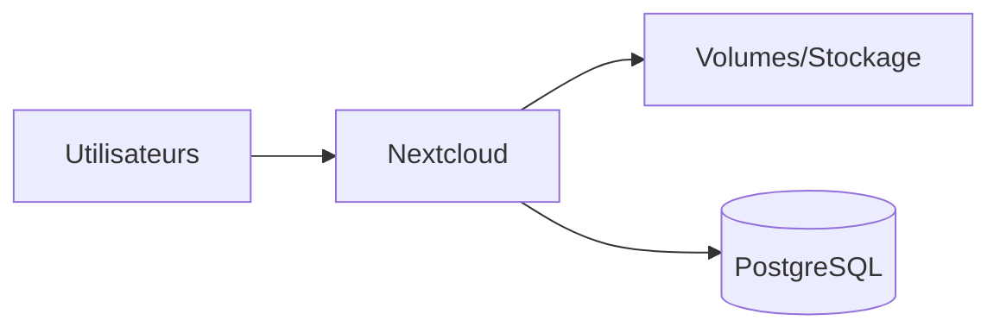

# NextCloud


    

## 🧠 Description
**NextCloud** plateforme de cloud personnel (fichiers, agenda, contacts, collaboration) extensible via apps.

## ⚙️ Fonctions principales
- ☁️ Fichiers & partage
- 📅 Agenda/Contacts (apps)
- 🗂️ Apps (OnlyOffice, Talk, etc.)
- 🔐 SSO/OIDC (selon config)
- 🧩 WebDAV

## 🔗 Intégrations
- [[Keycloak]]
- [[Nginx Proxy Manager]]
- [[Traefik]]
- [[Syncthing]]

## 🧬 Flux de données


# Intégration

## Pré-requis
- Docker + Docker Compose
- Volumes persistants (recommandé)
- (Optionnel) DNS / certificats / authentification selon usage

## Docker-compose
```yaml
services:
  nextcloud-db:
    image: postgres:16
    container_name: nextcloud-db
    restart: unless-stopped
    environment:
      - POSTGRES_DB=nextcloud
      - POSTGRES_USER=adrientanaka
      - POSTGRES_PASSWORD=${NEXTCLOUD_DB_PASSWORD:-CHANGE_ME_DB_PASSWORD}
    volumes:
      - ./nextcloud/postgres:/var/lib/postgresql/data

  nextcloud-redis:
    image: redis:7-alpine
    container_name: nextcloud-redis
    restart: unless-stopped
    volumes:
      - ./nextcloud/redis:/data

  nextcloud:
    image: nextcloud:29-apache
    container_name: nextcloud
    restart: unless-stopped
    depends_on:
      - nextcloud-db
      - nextcloud-redis
    ports:
      - "8087:80"
    environment:
      - POSTGRES_HOST=nextcloud-db
      - POSTGRES_DB=nextcloud
      - POSTGRES_USER=adrientanaka
      - POSTGRES_PASSWORD=${NEXTCLOUD_DB_PASSWORD:-CHANGE_ME_DB_PASSWORD}
      - REDIS_HOST=nextcloud-redis
      - TZ=Europe/Paris
    volumes:
      - ./nextcloud/html:/var/www/html
      - ./nextcloud/data:/var/www/html/data
```

# Liens externes
- GitHub : https://github.com/nextcloud/server
- Site : https://nextcloud.com

# Notes
- À compléter

# Avis de l'auteur
- À compléter
