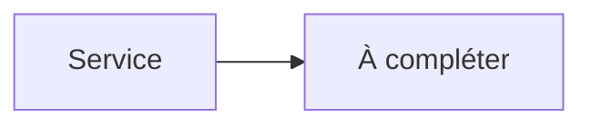

# VaultWarden


    

## 🧠 Description
**VaultWarden** implémentation légère compatible Bitwarden pour héberger ton gestionnaire de mots de passe.

## ⚙️ Fonctions principales
- 🔑 Coffre Bitwarden compatible
- 👥 Organisations & partages
- 🔒 WebVault + API
- 🧾 Journaux & admin token
- 🔌 WebSocket (temps réel)

## 🔗 Intégrations
- [[NGINX]]
- [[Traefik]]
- [[Nginx Proxy Manager]]

## 🧬 Flux de données


# Intégration

## Pré-requis
- Docker + Docker Compose
- DNS/ports ouverts selon l’usage
- (Optionnel) Base de données selon le service (voir ci-dessous)

## Docker-compose
```yaml
services:
  vaultwarden:
    image: vaultwarden/server:latest
    container_name: vaultwarden
    restart: unless-stopped
    environment:
      - TZ=Europe/Paris
      - WEBSOCKET_ENABLED=true
      - SIGNUPS_ALLOWED=false
      # Génère une admin token : openssl rand -base64 48
      - ADMIN_TOKEN=${VAULTWARDEN_ADMIN_TOKEN:-CHANGE_ME_ADMIN_TOKEN}
    ports:
      - "8082:80"
    volumes:
      - ./vaultwarden/data:/data
```

# Liens externes
- GitHub : https://github.com/dani-garcia/vaultwarden
- Site : https://github.com/dani-garcia/vaultwarden

# Notes
- À compléter

# Avis de l'auteur
- À compléter
