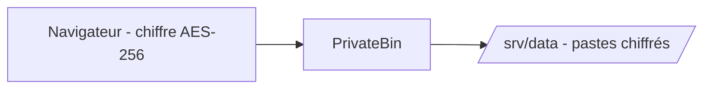

# PrivateBin


    

## 🧠 Description
**PrivateBin** pastebin minimaliste et open source où le serveur n'a **aucune connaissance** du contenu : chiffrement/déchiffrement AES-256 réalisé dans le navigateur (zero-knowledge), la clé voyage dans le fragment de l'URL et n'atteint jamais le serveur.

## ⚙️ Fonctions principales
- 🔐 Chiffrement côté client (AES-256, zero-knowledge)
- ⏳ Expiration automatique des pastes (5 min → jamais)
- 🔥 Burn after reading (destruction à la première lecture)
- 🔑 Protection par mot de passe additionnel
- 💬 Discussions/commentaires sur un paste (optionnel)
- 📎 Upload de fichiers joints (optionnel, désactivé par défaut)
- 📱 QR code de partage

## 🔗 Intégrations
- [[Nginx Proxy Manager]]
- [[Traefik]]

## 🧬 Flux de données


# Intégration

## Pré-requis
- Docker + Docker Compose
- Volume persistant pour `/srv/data`, appartenant à l'UID `65534` (user `nobody` de l'image)
- Reverse proxy HTTPS fortement recommandé : le chiffrement se fait en JavaScript dans le navigateur, servir la page en clair ruinerait la promesse de confidentialité

## Docker-compose
```yaml
services:
  privatebin:
    image: privatebin/nginx-fpm-alpine:latest
    container_name: privatebin
    restart: unless-stopped
    # Recommandé par le projet : le conteneur fonctionne en lecture seule
    read_only: true
    environment:
      - TZ=Europe/Paris
    ports:
      - "8080:8080"
    volumes:
      - ./privatebin/data:/srv/data
      # Configuration avancée (expirations, taille max, thème, upload...) :
      # - ./privatebin/cfg/conf.php:/srv/cfg/conf.php:ro
```

# Liens externes
- GitHub : https://github.com/PrivateBin/PrivateBin
- Site : https://privatebin.info/
- Image Docker : https://github.com/PrivateBin/docker-nginx-fpm-alpine

# Notes
- Préparer le volume avant le premier lancement : `mkdir -p ./privatebin/data && chown -R 65534:82 ./privatebin/data` (sinon erreur 500 au premier paste).
- La configuration se fait via `conf.php` (partir du [conf.sample.php](https://github.com/PrivateBin/PrivateBin/blob/master/cfg/conf.sample.php) du projet) : limite de taille (2 Mo par défaut), durées d'expiration proposées, activation de l'upload de fichiers, thème.
- Stockage par défaut sur le système de fichiers : aucune base de données requise. La sauvegarde se résume à archiver `./privatebin/data`.
- Pas de comptes utilisateurs ni d'interface d'administration : si l'instance est exposée publiquement, prévoir du rate-limiting au niveau du reverse proxy (le `trafficlimit` de `conf.php` aide aussi) pour éviter d'héberger le pastebin de spammeurs.
- Le serveur ne pouvant pas lire les pastes, il ne peut pas non plus les indexer ou les retrouver : conserver l'URL complète (fragment inclus), c'est elle qui porte la clé.

# Avis de l'auteur
- À compléter
