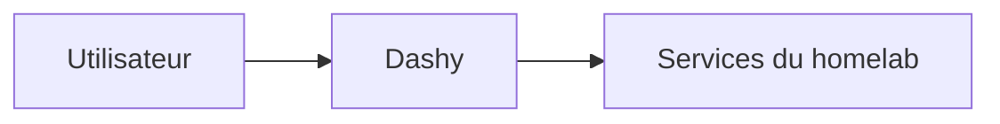

# Dashy


    

## 🧠 Description
**Dashy** dashboard personnel auto-hébergé pour centraliser les liens et widgets de ton homelab.

## ⚙️ Fonctions principales
- 🧩 Widgets
- 🔎 Recherche
- 🗂️ Sections/tiles
- 🔐 Auth (selon config)
- 🎨 Thèmes

## 🔗 Intégrations
- [[Portainer]]
- [[Grafana]]
- [[Uptime Kuma]]

## 🧬 Flux de données


# Intégration

## Pré-requis
- Docker + Docker Compose
- Volumes persistants (recommandé)
- (Optionnel) DNS / certificats / authentification selon usage

## Docker-compose
```yaml
services:
  dashy:
    image: lissy93/dashy:latest
    container_name: dashy
    restart: unless-stopped
    environment:
      - TZ=Europe/Paris
      # (Optionnel) Auth basique via env si souhaité
    ports:
      - "8080:8080"
    volumes:
      - ./dashy/conf.yml:/app/public/conf.yml:ro
```

# Liens externes
- GitHub : https://github.com/Lissy93/dashy
- Site : https://dashy.to/

# Notes
- À compléter

# Avis de l'auteur
- À compléter
