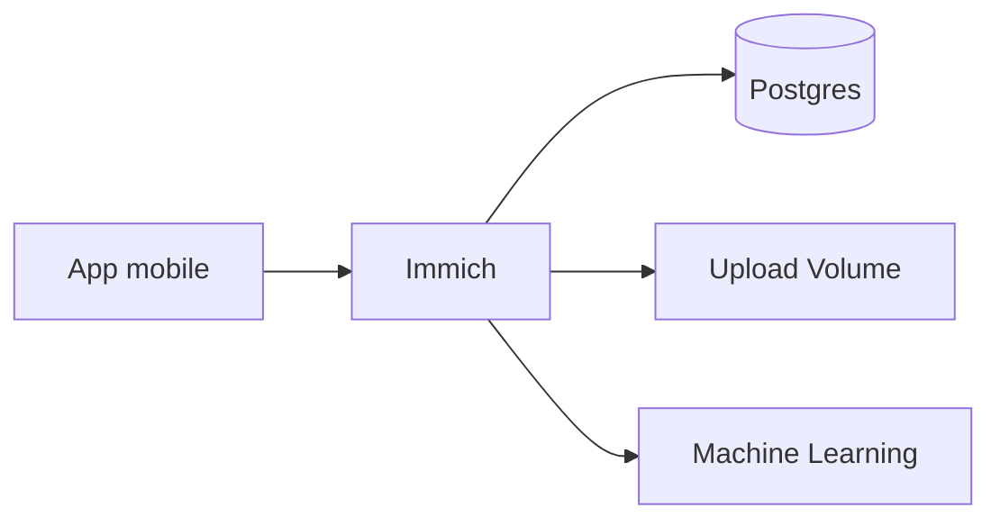

# Immich


    

## 🧠 Description
**Immich** solution de sauvegarde/galerie photos type Google Photos (upload mobile, albums, recherche, ML).

## ⚙️ Fonctions principales
- 📸 Backup mobile
- 🖼️ Galerie & albums
- 🔎 Recherche + ML
- 👥 Partage
- 🗄️ Stockage persistant

## 🔗 Intégrations
- [[Uptime Kuma]]
- [[Nginx Proxy Manager]]
- [[Traefik]]

## 🧬 Flux de données


# Intégration

## Pré-requis
- Docker + Docker Compose
- Volumes persistants (recommandé)
- (Optionnel) DNS / certificats / authentification selon usage

## Docker-compose
```yaml
services:
  immich-redis:
    image: redis:7-alpine
    container_name: immich-redis
    restart: unless-stopped
    volumes:
      - ./immich/redis:/data

  immich-db:
    image: tensorchord/pgvecto-rs:pg16-v0.2.0
    container_name: immich-db
    restart: unless-stopped
    environment:
      - POSTGRES_DB=immich
      - POSTGRES_USER=adrientanaka
      - POSTGRES_PASSWORD=${IMMICH_DB_PASSWORD:-CHANGE_ME_DB_PASSWORD}
    volumes:
      - ./immich/postgres:/var/lib/postgresql/data

  immich-server:
    image: ghcr.io/immich-app/immich-server:release
    container_name: immich-server
    restart: unless-stopped
    depends_on:
      - immich-db
      - immich-redis
    environment:
      - DB_HOSTNAME=immich-db
      - DB_DATABASE_NAME=immich
      - DB_USERNAME=adrientanaka
      - DB_PASSWORD=${IMMICH_DB_PASSWORD:-CHANGE_ME_DB_PASSWORD}
      - REDIS_HOSTNAME=immich-redis
      # Génère un JWT : openssl rand -hex 32
      - JWT_SECRET=${IMMICH_JWT_SECRET:-CHANGE_ME_JWT_SECRET}
      - TZ=Europe/Paris
    ports:
      - "2283:3001"
    volumes:
      - ./immich/upload:/usr/src/app/upload

  immich-machine-learning:
    image: ghcr.io/immich-app/immich-machine-learning:release
    container_name: immich-ml
    restart: unless-stopped
    volumes:
      - ./immich/ml-cache:/cache
```

# Liens externes
- GitHub : https://github.com/immich-app/immich
- Site : https://immich.app

# Notes
- À compléter

# Avis de l'auteur
- À compléter
