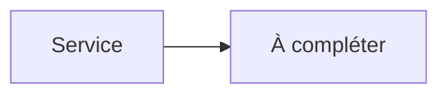

# Nginx Proxy Manager


    

## 🧠 Description
**Nginx Proxy Manager** interface web pour gérer facilement NGINX (reverse-proxy, certificats, hôtes, redirections).

## ⚙️ Fonctions principales
- 🌐 Reverse proxy via UI
- 🔒 Certificats Let's Encrypt
- 📦 Hôtes/proxys/redirections
- 📜 Logs
- 👥 Gestion accès (selon usage)

## 🔗 Intégrations
- [[Authelia]]
- [[VaultWarden]]
- [[NextCloud]]

## 🧬 Flux de données


# Intégration

## Pré-requis
- Docker + Docker Compose
- DNS/ports ouverts selon l’usage
- (Optionnel) Base de données selon le service (voir ci-dessous)

## Docker-compose
```yaml
services:
  npm:
    image: jc21/nginx-proxy-manager:latest
    container_name: nginx-proxy-manager
    restart: unless-stopped
    ports:
      - "80:80"
      - "81:81"      # UI
      - "443:443"
    volumes:
      - ./npm/data:/data
      - ./npm/letsencrypt:/etc/letsencrypt
```

# Liens externes
- GitHub : https://github.com/NginxProxyManager/nginx-proxy-manager
- Site : https://nginxproxymanager.com

# Notes
- À compléter

# Avis de l'auteur
- À compléter
