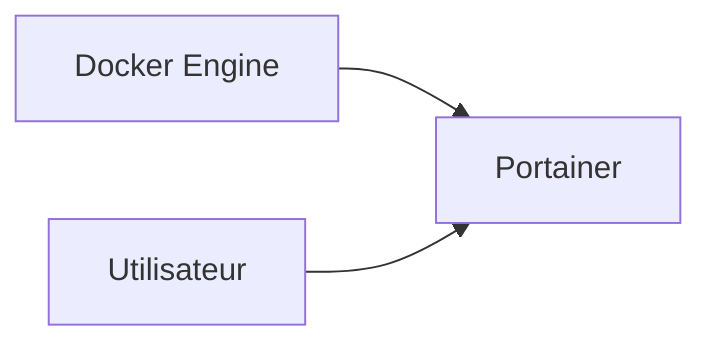

# Portainer


    

## 🧠 Description
**Portainer** interface d’administration Docker (containers, stacks, volumes, networks) utile pour piloter un homelab.

## ⚙️ Fonctions principales
- 🐳 Gestion Docker
- 📦 Stacks (Compose)
- 👥 RBAC (selon édition)
- 📊 Vue ressources
- 🔐 Secrets/registries (selon config)

## 🔗 Intégrations
- [[Traefik]]

## 🧬 Flux de données


# Intégration

## Pré-requis
- Docker + Docker Compose
- Volumes persistants (recommandé)
- (Optionnel) DNS / certificats / authentification selon usage

## Docker-compose
```yaml
services:
  portainer:
    image: portainer/portainer-ce:latest
    container_name: portainer
    restart: unless-stopped
    ports:
      - "9000:9000"
      - "9443:9443"
    volumes:
      - /var/run/docker.sock:/var/run/docker.sock
      - ./portainer/data:/data
```

# Liens externes
- GitHub : https://github.com/portainer/portainer
- Site : https://www.portainer.io/

# Notes
- À compléter

# Avis de l'auteur
- À compléter
