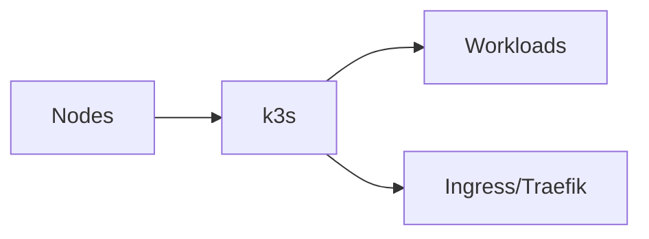

# k3s


    

## 🧠 Description
**k3s** distribution Kubernetes légère, idéale pour un cluster homelab (ARM/x86) avec peu de ressources.

## ⚙️ Fonctions principales
- ☸️ Kubernetes léger
- 📦 Helm/Manifests
- 🧩 Add-ons
- 🔐 RBAC
- 📈 Observabilité (à intégrer)

## 🔗 Intégrations
- [[Traefik]]
- [[Prometheus]]

## 🧬 Flux de données


# Intégration

## Pré-requis
- Docker + Docker Compose
- Accès au matériel si nécessaire (ex: USB, GPIO, etc.)
- Volumes persistants (recommandé)

## Docker-compose
```yaml
services:
  k3s:
    image: rancher/k3s:latest
    container_name: k3s
    restart: unless-stopped
    privileged: true
    command: server
    environment:
      - TZ=Europe/Paris
      # Token cluster : openssl rand -hex 32
      - K3S_TOKEN=${K3S_TOKEN:-CHANGE_ME_CLUSTER_TOKEN}
    ports:
      - "6443:6443"   # Kubernetes API
    volumes:
      - ./k3s/data:/var/lib/rancher/k3s
      - /var/run:/var/run
```

# Liens externes
- GitHub : https://github.com/k3s-io/k3s
- Site : https://k3s.io/

# Notes
- À compléter

# Avis de l'auteur
- À compléter
