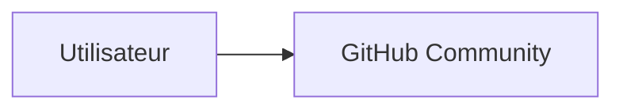

# GitHub Community


> Badges GitHub indisponibles (repo non renseigné).

## 🧠 Description
**GitHub Community** espace communautaire GitHub (discussions, entraide). Utile comme “référence” dans ton catalogue, même si ce n’est pas un service auto-hébergé.

## ⚙️ Fonctions principales
- 💬 Discussions
- 🧭 Recherche de solutions
- 📌 Annonces/updates
- 🤝 Support communautaire

## 🔗 Intégrations
- [[SonarQube]]

## 🧬 Flux de données


# Intégration

## Pré-requis
- Docker + Docker Compose
- Volumes persistants (recommandé)
- (Optionnel) DNS / certificats / authentification selon usage

## Docker-compose
```yaml
# Service SaaS (non auto-hébergé)
```

# Liens externes
- GitHub : https://NOGITHUBLINK.COM/
- Site : https://github.com/community

# Notes
- À compléter

# Avis de l'auteur
- À compléter
