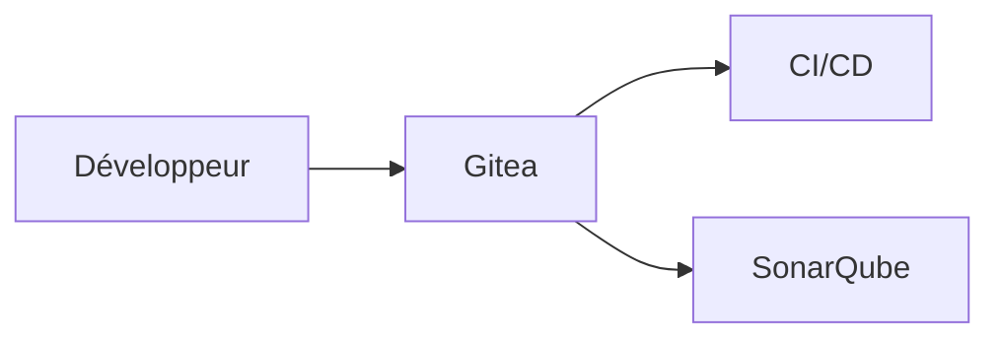

# Gitea


    

## 🧠 Description
**Gitea** forge Git auto-hébergée (issues, PR, wiki, actions selon version) alternative légère à GitHub.

## ⚙️ Fonctions principales
- 🧑‍💻 Repos Git
- 🔀 PR/MR
- 🐞 Issues
- 📦 Packages (selon version)
- 🔐 SSO (selon config)

## 🔗 Intégrations
- [[SonarQube]]
- [[Keycloak]]

## 🧬 Flux de données


# Intégration

## Pré-requis
- Docker + Docker Compose
- Accès au matériel si nécessaire (ex: USB, GPIO, etc.)
- Volumes persistants (recommandé)

## Docker-compose
```yaml
services:
  gitea-db:
    image: postgres:16
    container_name: gitea-db
    restart: unless-stopped
    environment:
      - POSTGRES_DB=gitea
      - POSTGRES_USER=adrientanaka
      - POSTGRES_PASSWORD=${GITEA_DB_PASSWORD:-CHANGE_ME_DB_PASSWORD}
    volumes:
      - ./gitea/postgres:/var/lib/postgresql/data

  gitea:
    image: gitea/gitea:latest
    container_name: gitea
    restart: unless-stopped
    depends_on:
      - gitea-db
    environment:
      - USER_UID=1000
      - USER_GID=1000
      - GITEA__database__DB_TYPE=postgres
      - GITEA__database__HOST=gitea-db:5432
      - GITEA__database__NAME=gitea
      - GITEA__database__USER=adrientanaka
      - GITEA__database__PASSWD=${GITEA_DB_PASSWORD:-CHANGE_ME_DB_PASSWORD}
      - TZ=Europe/Paris
    ports:
      - "3004:3000"
      - "2222:22"
    volumes:
      - ./gitea/data:/data
```

# Liens externes
- GitHub : https://github.com/go-gitea/gitea
- Site : https://gitea.io/en-us/

# Notes
- À compléter

# Avis de l'auteur
- À compléter
