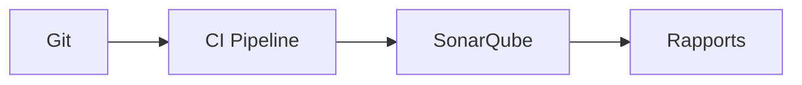

# SonarQube


    

## 🧠 Description
**SonarQube** plateforme d’analyse de qualité de code (bugs, vulnérabilités, code smells) intégrable aux pipelines CI/CD.

## ⚙️ Fonctions principales
- 🧪 Analyse statique
- 🔐 Détection vulnérabilités
- 📈 Qualité & couverture
- 🧩 Plugins/langages
- 🔁 Intégration CI

## 🔗 Intégrations
- [[Gitea]]
- [[GitHub Community]]

## 🧬 Flux de données


# Intégration

## Pré-requis
- Docker + Docker Compose
- Volumes persistants (recommandé)
- (Optionnel) DNS / certificats / authentification selon usage

## Docker-compose
```yaml
services:
  sonarqube-db:
    image: postgres:16
    container_name: sonarqube-db
    restart: unless-stopped
    environment:
      - POSTGRES_DB=sonarqube
      - POSTGRES_USER=adrientanaka
      - POSTGRES_PASSWORD=${SONARQUBE_DB_PASSWORD:-CHANGE_ME_DB_PASSWORD}
    volumes:
      - ./sonarqube/postgres:/var/lib/postgresql/data

  sonarqube:
    image: sonarqube:lts-community
    container_name: sonarqube
    restart: unless-stopped
    depends_on:
      - sonarqube-db
    environment:
      - SONAR_JDBC_URL=jdbc:postgresql://sonarqube-db:5432/sonarqube
      - SONAR_JDBC_USERNAME=adrientanaka
      - SONAR_JDBC_PASSWORD=${SONARQUBE_DB_PASSWORD:-CHANGE_ME_DB_PASSWORD}
      - TZ=Europe/Paris
    ports:
      - "9001:9000"
    volumes:
      - ./sonarqube/data:/opt/sonarqube/data
      - ./sonarqube/extensions:/opt/sonarqube/extensions
      - ./sonarqube/logs:/opt/sonarqube/logs
```

# Liens externes
- GitHub : https://github.com/SonarSource/sonarqube
- Site : https://www.sonarsource.com/products/sonarqube/

# Notes
- À compléter

# Avis de l'auteur
- À compléter
