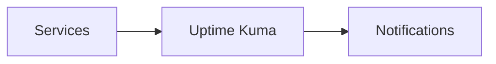

# Uptime Kuma


    

## 🧠 Description
**Uptime Kuma** outil de monitoring simple (HTTP/TCP/DNS/etc.) avec page de statut et notifications.

## ⚙️ Fonctions principales
- 🟢 Checks multi-protocoles
- 📣 Notifications
- 📄 Status page
- 📈 Historique
- 🔑 Auth (selon config)

## 🔗 Intégrations
- [[Prometheus]]
- [[Notifiarr]]

## 🧬 Flux de données


# Intégration

## Pré-requis
- Docker + Docker Compose
- Volumes persistants (recommandé)
- (Optionnel) DNS / certificats / authentification selon usage

## Docker-compose
```yaml
services:
  uptime-kuma:
    image: louislam/uptime-kuma:latest
    container_name: uptime-kuma
    restart: unless-stopped
    ports:
      - "3002:3001"
    volumes:
      - ./uptime-kuma/data:/app/data
    environment:
      - TZ=Europe/Paris
```

# Liens externes
- GitHub : https://github.com/louislam/uptime-kuma
- Site : https://uptime.kuma.pet/

# Notes
- Premier lancement : l'interface (http://IP:3002) demande la création du compte administrateur — à faire immédiatement, l'instance est ouverte tant que ce n'est pas fait.
- Les données vivent dans une base SQLite sous `/app/data` : sauvegarder le dossier `./uptime-kuma/data` (idéalement conteneur arrêté, pour un backup cohérent de la base).
- Derrière un reverse proxy, activer le support **WebSocket** (case "Websockets Support" dans [[Nginx Proxy Manager]] ; rien de particulier sous [[Traefik]]), sinon l'interface reste bloquée en chargement.
- Les *status pages* publiques se configurent par groupe de monitors : bien choisir ce qu'on expose, une page de statut détaillée est aussi une cartographie de votre infra offerte aux curieux.
- Notifications : très large choix natif (Telegram, Discord, SMTP, Apprise, webhooks... dont [[Notifiarr]]).
- Métriques exposées sur `/metrics` (protégées par API key) pour scraping [[Prometheus]] et dashboard [[Grafana]].
- Mise à jour : `docker compose pull && docker compose up -d` — ou automatisée, voir le comparatif [[Duel_Docker_Podman_Kubernetes|Docker vs Podman vs Kubernetes]].

# Avis de l'auteur
- À compléter
