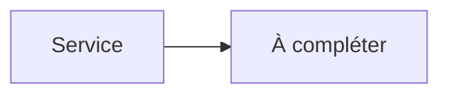

# NGINX


    

## 🧠 Description
**NGINX** serveur web et reverse-proxy très répandu, performant et flexible.

## ⚙️ Fonctions principales
- 🌐 Serveur web
- 🔁 Reverse-proxy
- 📦 Static files
- 🧩 Modules
- 🧾 Logs

## 🔗 Intégrations
- [[Authelia]]

## 🧬 Flux de données


# Intégration

## Pré-requis
- Docker + Docker Compose
- DNS/ports ouverts selon l’usage
- (Optionnel) Base de données selon le service (voir ci-dessous)

## Docker-compose
```yaml
services:
  nginx:
    image: nginx:stable
    container_name: nginx
    restart: unless-stopped
    ports:
      - "8084:80"
    volumes:
      - ./nginx/html:/usr/share/nginx/html:ro
      - ./nginx/conf.d:/etc/nginx/conf.d:ro
```

# Liens externes
- GitHub : https://github.com/nginx/nginx
- Site : https://nginx.org

# Notes
- À compléter

# Avis de l'auteur
- À compléter
